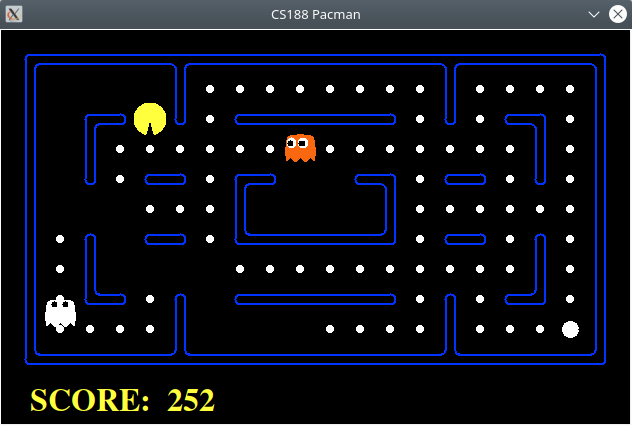

# Minimax with Alpha-beta pruning for Pacman


Minimax with Alpha-beta pruning for Pacman.

This code is written as an assignment for the course __TDT4136 - Introduction to Artificial Intelligence__ :school:

## How to run
```sh
git clone https://github.com/dilawarm/pacman.git
cd pacman
sudo apt install python3-tk 
```
### Play a game of classic pacman
```sh
python3 pacman.py
``` 
### Run the reflex agent
```sh
python3 pacman.py -p ReflexAgent
```
### Run the minimax agent
```sh
python3 pacman.py -p MinimaxAgent
```
### Run the minimax agent with alpha-beta pruning
```sh
python3 pacman.py -p AlphaBetaAgent
```

Enjoy! :rocket: